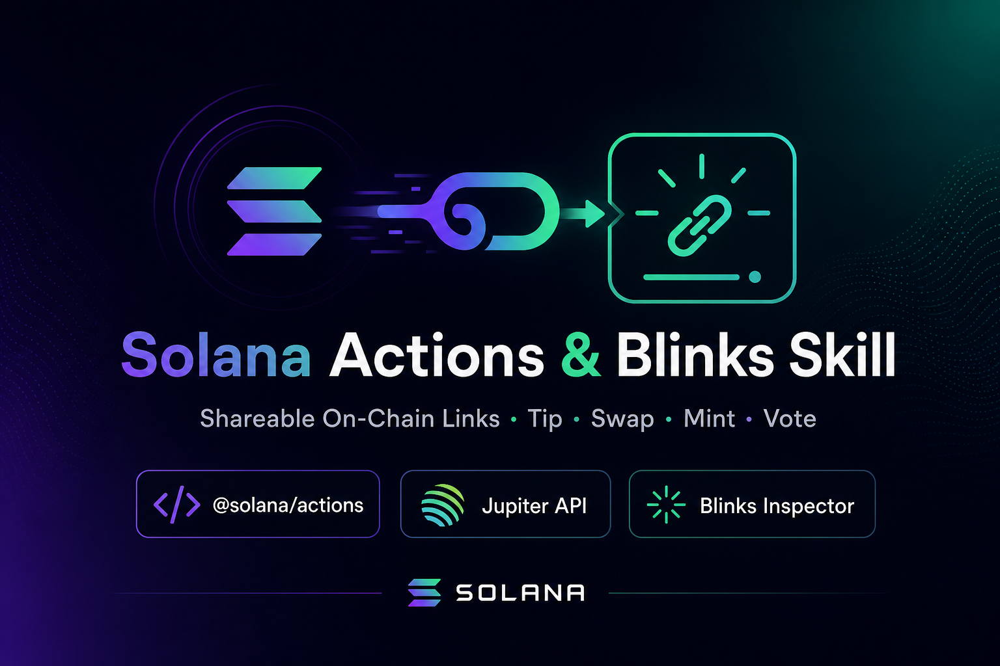
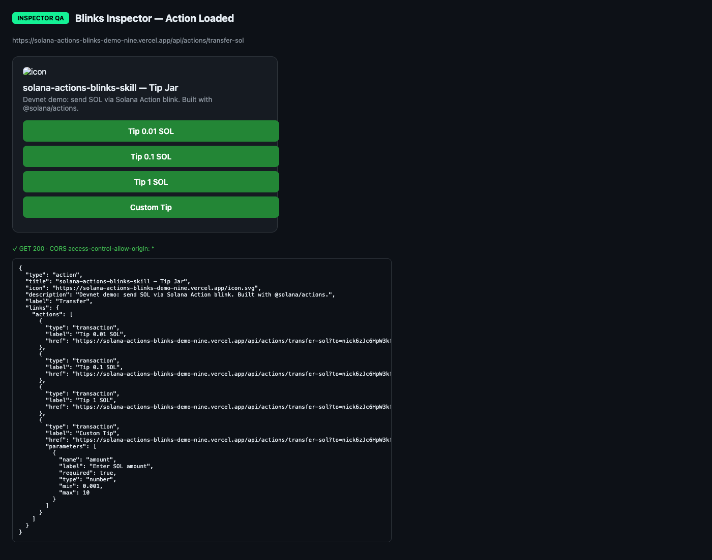

# Solana Actions & Blinks Skill for Claude Code

[](https://github.com/gautammanak1/solana-actions-blinks-skill/actions/workflows/ci.yml)
[](https://github.com/gautammanak1/solana-actions-blinks-skill/releases)
[](LICENSE)
[](https://solana.com/solutions/actions)
[](https://www.blinks.xyz/inspector)



A Claude Code / Cursor skill for building **Solana Actions** and **Blockchain Links (Blinks)** — shareable on-chain tip, swap, mint, and vote links with real `@solana/actions` SDK code and live Jupiter API integration.

> **Extends**: [solana-dev-skill](https://github.com/solana-foundation/solana-dev-skill) (optional — for Anchor programs & core security)

Built for the [Superteam Brasil · Solana AI Kit bounty](https://superteam.fun/earn/listing/skills).  
Reference structure: [solana-game-skill](https://github.com/solanabr/solana-game-skill).  
**Latest release:** [v1.0.0](https://github.com/gautammanak1/solana-actions-blinks-skill/releases/tag/v1.0.0) · See [CHANGELOG.md](CHANGELOG.md)

---

## Live demo (devnet)

| Resource | Link |
|----------|------|
| **Action API** | https://solana-actions-blinks-demo-nine.vercel.app/api/actions/transfer-sol |
| **dial.to blink** | [Open blink on dial.to](https://dial.to/?action=solana-action%3Ahttps%3A%2F%2Fsolana-actions-blinks-demo-nine.vercel.app%2Fapi%2Factions%2Ftransfer-sol) |
| **Blinks Inspector** | Paste Action URL at [blinks.xyz/inspector](https://www.blinks.xyz/inspector) |
| **Inspector proof** |  |
| **Release** | [v1.0.0](https://github.com/gautammanak1/solana-actions-blinks-skill/releases/tag/v1.0.0) |

```bash
curl -s https://solana-actions-blinks-demo-nine.vercel.app/api/actions/transfer-sol | jq '.title, .links.actions[].label'
```

Deploy your own: [demo/README.md](demo/README.md)

---

## Tags

`solana-actions` · `blinks` · `blockchain-links` · `solana-pay` · `jupiter-api` · `claude-skill` · `claude-code-skills` · `cursor-skills` · `solana-ai-kit` · `nextjs` · `dial-to` · `blinks-inspector` · `metaplex` · `realms-governance` · `superteam-brazil`

---

## Overview

This skill is an **addon** for the Solana AI Kit. It teaches coding agents how to ship spec-compliant Action endpoints (GET / POST / OPTIONS), `actions.json` domain mapping, and shareable blink URLs — while delegating Anchor program work to `solana-dev-skill`.

```
┌──────────────────────────────────────────────────────────────────┐
│              solana-actions-blinks-skill (addon)                 │
│                                                                  │
│  ┌────────────────────────────────────────────────────────────┐  │
│  │  Action Type Skills (6)                                    │  │
│  │  ├── SOL Tip Jar (transfer-sol pattern)                    │  │
│  │  ├── SPL / USDC Transfer                                   │  │
│  │  ├── Jupiter Swap (api.jup.ag/swap/v1)                     │  │
│  │  ├── NFT Mint (Metaplex CM / Core)                         │  │
│  │  ├── DAO Vote (Realms Yes / No / Abstain)                  │  │
│  │  └── Message Sign-In (action chaining)                     │  │
│  └────────────────────────────────────────────────────────────┘  │
│                              │                                   │
│  ┌────────────────────────────────────────────────────────────┐  │
│  │  Infrastructure Skills                                     │  │
│  │  ├── Spec (GET/POST, CORS, parameters)                     │  │
│  │  ├── actions.json domain mapping                           │  │
│  │  ├── Security (signer, rate limits)                        │  │
│  │  ├── Next.js integration + deploy                          │  │
│  │  └── Blinks Inspector + Dialect registry                   │  │
│  └────────────────────────────────────────────────────────────┘  │
│                              │                                   │
│                              ▼ references (optional)             │
│  ┌────────────────────────────────────────────────────────────┐  │
│  │  solana-dev-skill (core)                                   │  │
│  │  ├── Programs (Anchor, Pinocchio)                          │  │
│  │  ├── Testing (LiteSVM, Mollusk, Surfpool)                    │  │
│  │  └── Security (program + client checklists)                  │  │
│  └────────────────────────────────────────────────────────────┘  │
└──────────────────────────────────────────────────────────────────┘
```

---

## What's Included

### Action Type Skills (This Addon)

| Skill | Description |
|-------|-------------|
| [tip-jar.md](skill/tip-jar.md) | SOL tip jar — official [transfer-sol](https://github.com/solana-developers/solana-actions) pattern |
| [spl-transfer.md](skill/spl-transfer.md) | USDC / SPL token tips with ATA creation |
| [jupiter-swap.md](skill/jupiter-swap.md) | Live Jupiter swap blink (`api.jup.ag/swap/v1`) |
| [nft-mint.md](skill/nft-mint.md) | Metaplex Candy Machine / Core mint blink |
| [governance-vote.md](skill/governance-vote.md) | Realms DAO vote — Yes / No / Abstain |
| [message-sign.md](skill/message-sign.md) | Wallet sign-in + multi-step action chains |

### Infrastructure Skills

| Skill | Description |
|-------|-------------|
| [actions-spec.md](skill/actions-spec.md) | Full Actions spec — GET/POST bodies, parameters, lifecycle |
| [blink-builder.md](skill/blink-builder.md) | Endpoint patterns, linked actions, blink URLs |
| [actions-json.md](skill/actions-json.md) | Domain root `actions.json` mapping + CORS |
| [callback-security.md](skill/callback-security.md) | Signer validation, input sanitization, rate limits |
| [nextjs-integration.md](skill/nextjs-integration.md) | Next.js App Router, Vercel, Cloudflare tunnels |
| [testing-debugging.md](skill/testing-debugging.md) | [Blinks Inspector](https://www.blinks.xyz/inspector), [dial.to](https://dial.to), Dialect registry |
| [resources.md](skill/resources.md) | Curated official links |

### Reference Data (Real APIs)

| Reference | Description |
|-----------|-------------|
| [reference/constants.md](skill/reference/constants.md) | RPC URLs, USDC/SOL mints, program IDs |
| [reference/sdk-api.md](skill/reference/sdk-api.md) | `createActionHeaders`, `createPostResponse` |
| [reference/jupiter-api.md](skill/reference/jupiter-api.md) | Jupiter quote/swap curl + TypeScript |

### Working Templates

| Template | Description |
|----------|-------------|
| [templates/transfer-sol-route.ts](templates/transfer-sol-route.ts) | Official solana-actions SOL transfer handler |
| [templates/jupiter-swap-route.ts](templates/jupiter-swap-route.ts) | Jupiter USDC→SOL swap handler |
| [templates/actions.json](templates/actions.json) | Domain mapping for all action types |
| [templates/env.example](templates/env.example) | `SOLANA_RPC`, `JUPITER_API_KEY`, etc. |

---

## Installation

### Standard Install (Recommended)

For scripts, CI/CD, or quick setup with defaults:

```bash
git clone https://github.com/gautammanak1/solana-actions-blinks-skill.git
cd solana-actions-blinks-skill
./install.sh        # Interactive
./install.sh -y     # Non-interactive, all defaults
```

**Standard defaults:**
- Cursor → `~/.cursor/skills/solana-actions-blinks/`
- Claude Code → `~/.claude/skills/solana-actions-blinks/`
- Bundles: `skill/`, `commands/`, `agents/`, `templates/`
- Copies `CLAUDE.md` to `~/.claude/`

### If You Already Have solana-dev-skill

This skill **extends** the core dev skill for program work. Install this addon on top — it does not replace `solana-dev-skill`.

---

## Default Stack (June 2026)

### Actions API

| Layer | Choice |
|-------|--------|
| SDK | `@solana/actions` 1.6+ |
| Headers | `createActionHeaders()` |
| POST response | `createPostResponse()` |
| RPC env var | `SOLANA_RPC` |
| Spec | [Solana Actions guide](https://solana.com/developers/guides/advanced/actions) |

### Swap Actions

| Layer | Choice |
|-------|--------|
| API | `https://api.jup.ag/swap/v1` |
| Auth | `x-api-key` from [portal.jup.ag](https://portal.jup.ag) |
| Tx type | `VersionedTransaction` |

### Web Frontends

| Layer | Choice |
|-------|--------|
| Framework | Next.js 15 (App Router) |
| Routes | `src/app/api/actions/<name>/route.ts` |
| Domain map | `public/actions.json` |
| Deploy | Vercel + HTTPS required |

### Testing

| Tool | URL |
|------|-----|
| Blinks Inspector | https://www.blinks.xyz/inspector |
| dial.to interstitial | https://dial.to |
| Dialect registry | https://dial.to/register |

---

## Agents

| Agent | Model | Purpose |
|-------|-------|---------|
| **actions-architect** | opus | Design endpoints, actions.json, security model |
| **blink-engineer** | sonnet | Implement routes, pass Inspector QA |

See [agents/](agents/) directory.

---

## Commands

| Command | Purpose |
|---------|---------|
| **/build-tip-action** | Scaffold SOL tip jar Action |
| **/build-swap-action** | Scaffold Jupiter swap blink |
| **/build-mint-action** | Scaffold NFT mint blink |
| **/build-vote-action** | Scaffold Realms vote blink |
| **/test-blink** | curl + Blinks Inspector QA checklist |
| **/register-dialect** | X/Twitter unfurl registry steps |
| **/scaffold-blink** | Generic Action scaffold |

See [commands/](commands/) directory.

---

## Usage Examples

Copy-paste these prompts into Claude Code or Cursor after installing the skill.

### SOL Tip Jar

```
"Build a devnet SOL tip jar Action with GET/POST/OPTIONS using createActionHeaders"
"Scaffold transfer-sol route with preset amounts 0.01, 0.1, 1 SOL and custom input"
"Add actions.json mapping /tip to my Action API endpoint"
```

### USDC / SPL Tips

```
"Create a USDC tip blink with SPL transfer and ATA creation on devnet"
"Secure my SPL Action — hardcode treasury, validate balance server-side"
```

### Jupiter Swap

```
"Build a Jupiter USDC→SOL swap blink using api.jup.ag/swap/v1"
"Add slippage selector (0.5%, 1%, 3%) and simulate tx before returning"
```

### NFT Mint

```
"Scaffold an NFT mint blink for my Metaplex collection with live supply in GET"
"Return disabled state when mint is sold out or window closed"
```

### DAO Governance

```
"Create a Realms vote blink with Vote Yes, Vote No, and Abstain buttons"
"Check on-chain proposal state and disable buttons when voting closes"
```

### Security & Testing

```
"Secure my Action POST endpoint against wrong signers and replay attacks"
"Run /test-blink on my deployed Action URL with curl and Inspector steps"
"Generate a dial.to share link for my tip jar Action"
```

### Program Development (via core skill)

```
"Create an Anchor program for my mint Action backend"
"Set up LiteSVM tests for my on-chain vote program"
```

---

## Quick Start

```bash
# 1. Install skill
git clone https://github.com/gautammanak1/solana-actions-blinks-skill.git
cd solana-actions-blinks-skill
./install.sh -y

# 2. Validate locally
npm install && npm run test:ci

# 3. Copy template into your Next.js app
cp templates/transfer-sol-route.ts  your-app/src/app/api/actions/transfer-sol/route.ts
cp templates/transfer-sol-const.ts  your-app/src/app/api/actions/transfer-sol/const.ts
cp templates/actions.json           your-app/public/actions.json

# 4. Test GET
curl -s http://localhost:3000/api/actions/transfer-sol | jq '.links.actions[].label'

# 5. Test in Inspector → https://www.blinks.xyz/inspector
```

---

## Environment Variables

| Variable | Required for | Example |
|----------|--------------|---------|
| `SOLANA_RPC` | All actions | `https://devnet.helius-rpc.com/?api-key=...` |
| `TREASURY_WALLET` | Tip / transfer | Your base58 pubkey |
| `NEXT_PUBLIC_SITE_URL` | Icon URLs | `https://yourdomain.com` |
| `JUPITER_API_KEY` | Swap actions | From [portal.jup.ag](https://portal.jup.ag) |
| `USDC_MINT` | SPL transfer | Devnet: `4zMMC9srt5Ri5X14GAgXhaHii3GnPAEERYPJgZJDncDU` |

Full list: [templates/env.example](templates/env.example)

---

## CI/CD & Infrastructure

Every push runs automated checks — skill structure and templates never break silently.

```
push / PR → validate-structure → typecheck-templates → install-smoke-test → ci-gate ✓
```

| Job | Checks |
|-----|--------|
| **validate-structure** | Required files, SKILL.md frontmatter, SDK patterns, ShellCheck |
| **typecheck-templates** | `tsc --noEmit` on `templates/*.ts` |
| **install-smoke-test** | `./install.sh -y` + verify skill installed |

Run locally:

```bash
npm install && npm run test:ci
bash scripts/validate-skill.sh
```

Pipeline: [.github/workflows/ci.yml](.github/workflows/ci.yml)

---

## Repository Structure

```
solana-actions-blinks-skill/
├── assets/banner.png              # README banner
├── CLAUDE.md                      # Claude configuration
├── README.md                      # This file
├── install.sh                     # Standard installer
├── package.json                   # Template typecheck deps
│
├── skill/                         # Skill modules
│   ├── SKILL.md                  # Entry point + routing
│   ├── tip-jar.md                # Action type skills (6)
│   ├── jupiter-swap.md
│   ├── ...
│   └── reference/                # Real constants & APIs
│
├── templates/                     # Copy-paste route handlers
├── commands/                      # 7 workflow commands
├── agents/                        # actions-architect + blink-engineer
├── scripts/validate-skill.sh      # CI validation script
└── .github/workflows/ci.yml       # CI/CD pipeline
```

---

## Development Workflow

### Two-Strike Rule

If a build, Inspector test, or typecheck fails twice on the same issue:

1. The agent will **STOP** immediately
2. Present error output and the attempted fix
3. Ask for user guidance

### Required SDK Patterns

Agents must use official SDK helpers — never hand-roll:

```typescript
import { createActionHeaders, createPostResponse } from "@solana/actions";
const headers = createActionHeaders();
const payload = await createPostResponse({ fields: { transaction, message } });
```

Do **not** use deprecated `ACTIONS_CORS_HEADERS` or manual base64 serialization.

---

## Bounty Submission

1. **Open PR** → [solanabr/skill-bounty](https://github.com/solanabr/skill-bounty)
2. **Submit questionnaire** → [Superteam listing](https://superteam.fun/earn/listing/skills)

PR title:
```
Submission: Add solana-actions-blinks-skill — Actions & Blinks with real SDK + Jupiter API
```

---

## Related

- [solana-dev-skill](https://github.com/solana-foundation/solana-dev-skill) — Core Solana development
- [solana-game-skill](https://github.com/solanabr/solana-game-skill) — Reference kit skill structure
- [solana-ai-kit](https://github.com/solanabr/solana-ai-kit) — Solana AI Kit hub
- [solana-actions SDK](https://github.com/solana-developers/solana-actions) — Official Actions examples
- [Solana Actions guide](https://solana.com/developers/guides/advanced/actions) — Spec documentation

---

## Contributing

Contributions welcome! Please ensure updates reflect current Solana Actions ecosystem best practices.

1. Fork the repository
2. Create a feature branch: `git checkout -b feat/my-feature-30-06-2026`
3. Run `npm run test:ci` before submitting
4. Open a pull request

---

## License

MIT License — see [LICENSE](LICENSE) for details.

---

Submission for [Superteam Brazil · Solana AI Kit Bounty](https://superteam.fun/earn/listing/skills)
